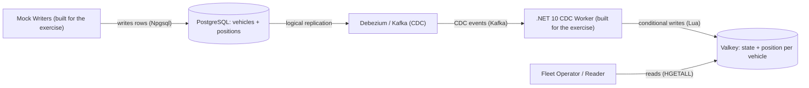
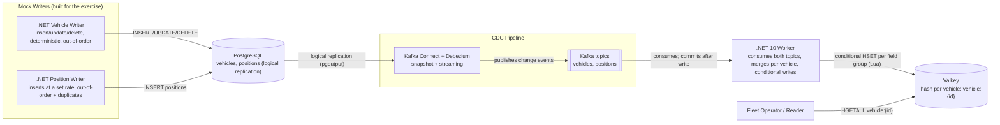
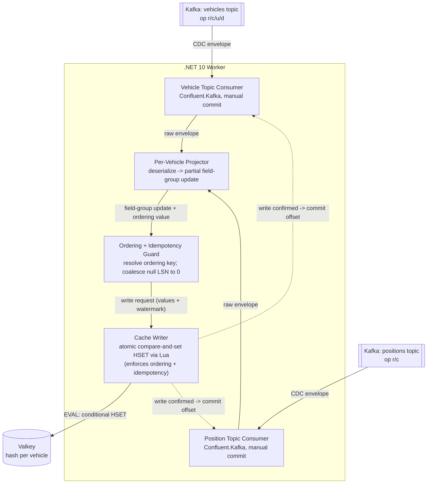

# C4 Model (flowchart rendering) — CDC-Driven Vehicle Cache

This is a **readability-oriented alternative** to `docs/c4.md`. It describes the
exact same three C4 levels, but authored as Mermaid `flowchart` instead of the
native C4 shapes — flowchart gives GitHub more room to space nodes and place
edge labels without overlap. The canonical C4 (with boundaries and the C4
notation) lives in `docs/c4.md`; if the two ever disagree, `docs/c4.md` wins.

Data-store shapes (cylinders) are Postgres/Valkey; the double-bordered shapes
are Kafka topics. Dotted arrows are control/feedback (offset commits).

- Level 1 — System Context
- Level 2 — Containers
- Level 3 — Components (worker)

---

## Level 1 — System Context

---

## Level 2 — Containers

---

## Level 3 — Components (worker)

Notes (same as `docs/c4.md`):

- The per-vehicle **merge is emergent in the Valkey hash** via independent
  per-field-group partial writes (ADR-005); the worker performs no in-memory
  join and holds no cross-stream buffer.
- **Ordering + idempotency are enforced atomically inside the Lua script**
  (Cache Writer), not by a read-then-decide step in the worker.
- Offsets are committed **after** the write is confirmed (ADR-002), so a crash
  mid-stream redelivers and safely re-applies as a no-op.
