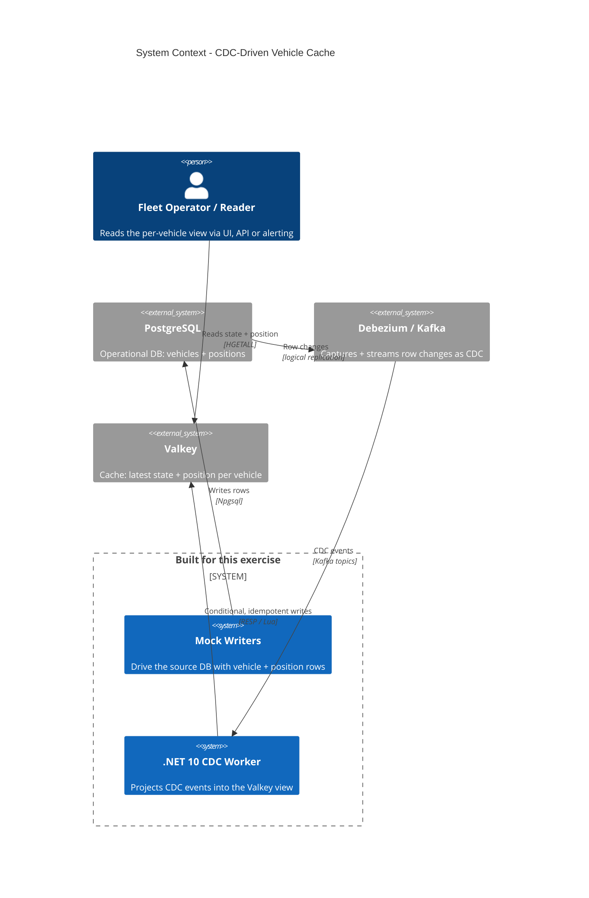
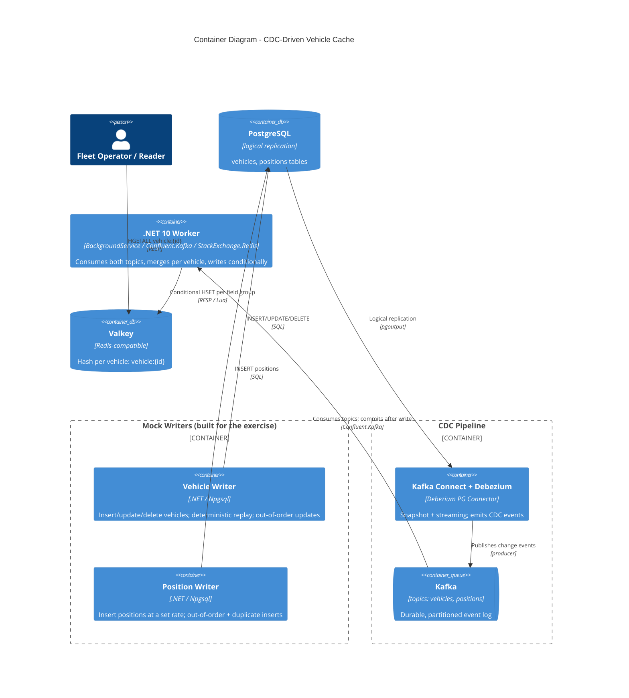
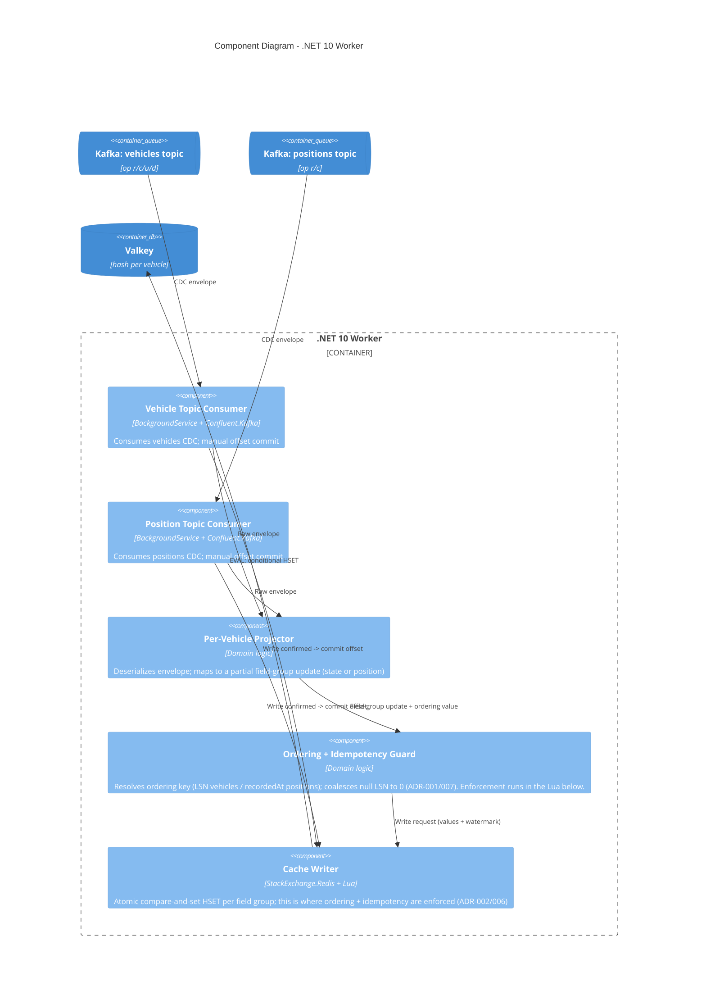

# C4 Model — CDC-Driven Vehicle Cache

Diagrams are authored in Mermaid so they render directly on GitHub. They must
match what `just e2e` actually runs.

- Level 1 — System Context
- Level 2 — Containers
- Level 3 — Components (worker)

> A more spacing-friendly `flowchart` rendering of these same three levels is
> kept in `docs/c4-flowchart.md` for readability; both describe the same system.

---

## Level 1 — System Context

---

## Level 2 — Containers

---

## Level 3 — Components (worker)

Notes:

- The per-vehicle **merge is emergent in the Valkey hash** via independent
  per-field-group partial writes (ADR-005); the worker performs no in-memory
  join and holds no cross-stream buffer.
- **Ordering + idempotency are enforced atomically inside the Lua script**
  (Cache Writer), not by a read-then-decide step in the worker, which would be
  racy. The Ordering Guard only resolves/normalizes the ordering value.
- Offsets are committed **after** the write is confirmed (ADR-002), so a crash
  mid-stream redelivers and safely re-applies as a no-op.
